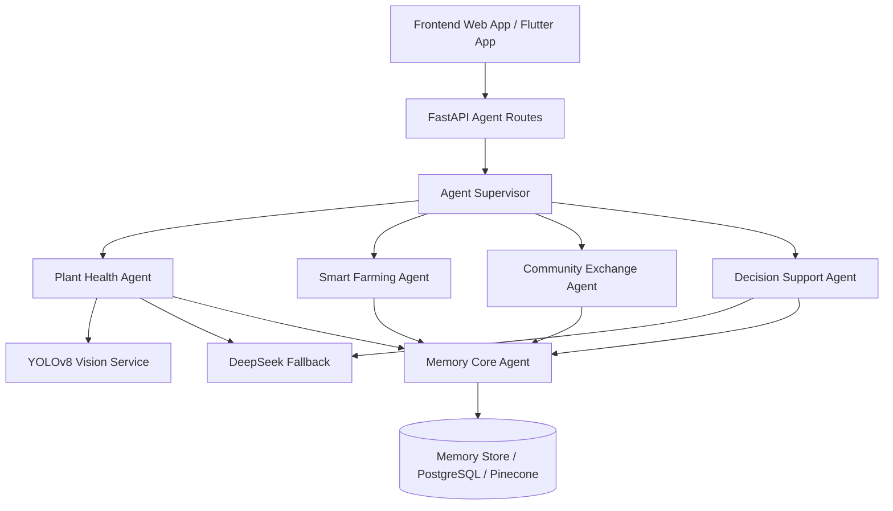

# KebunKita Agents

## Purpose

This document describes the agent system used in KebunKita. The agents turn user actions into useful gardening workflows: plant diagnosis, smart care planning, harvest exchange, and decision support.

The backend implementation lives in `backend/agents/`.

## Agent Architecture

KebunKita uses a supervised agent pattern.



## Agent List

| Agent | Backend File | Main Responsibility |
| --- | --- | --- |
| Agent Supervisor | `backend/agents/supervisor.py` | Routes requests to the correct agent |
| Plant Health Agent | `backend/agents/plant_health.py` | Diagnoses plant health from images |
| Smart Farming Agent | `backend/agents/smart_farming.py` | Generates daily plant care tasks |
| Community Exchange Agent | `backend/agents/community_exchange.py` | Matches harvest posts with community users |
| Decision Support Agent | `backend/agents/decision_support.py` | Answers farming questions and recommends crops/actions |
| Memory Core Agent | `backend/agents/memory_core.py` | Stores and retrieves agent history |

## Agent Supervisor

The Agent Supervisor is the routing layer between API routes and individual agents.

Responsibilities:

- Receive validated request data from FastAPI routes.
- Call the correct agent based on the feature.
- Keep frontend/API routing simple.
- Return agent output back to the API response model.

Current methods:

- `analyze_plant`
- `create_farming_plan`
- `match_harvest`
- `chat_support`

## Plant Health Agent

### Purpose

The Plant Health Agent helps users understand whether a plant is healthy, diseased, or unknown based on an uploaded or captured image.

### User Flow

1. User opens Plant Health or AI Disease Detection.
2. User uploads or captures a plant image.
3. Frontend sends the image to the backend.
4. Plant Health Agent calls YOLOv8 vision analysis.
5. Agent checks status and confidence.
6. If confidence is high, the agent returns a diagnosis and treatment.
7. If confidence is low, the agent uses DeepSeek fallback.
8. Result is saved to Memory Core.

### Inputs

- `user_id`
- `image_name`
- `image_bytes`
- `notes` optional

### Outputs

- `status`: healthy, diseased, or unknown
- `confidence`
- `disease_name`
- `symptoms`
- `treatment_plan`
- `recommendation`
- `memory_ref`

### AI Behavior

The agent uses:

- YOLOv8 for first-pass image analysis.
- DeepSeek when the image result is unknown or confidence is low.

### Guardrails

- Do not force a diagnosis when confidence is weak.
- Return `unknown` when evidence is insufficient.
- Suggest clearer image upload or fallback review when needed.
- Treatment suggestions must match the observed symptoms or fallback analysis.
- Save image result and recommendation into Memory Core.

## Smart Farming Agent

### Purpose

The Smart Farming Agent creates daily care tasks for a user plant. It helps users know what to do and why.

### User Flow

1. User opens Smart Farming, My Garden, or Crop Details.
2. User adds or selects a plant.
3. User provides plant name and optional budget.
4. Smart Farming Agent generates care tasks.
5. Tasks are saved to Memory Core.
6. Frontend displays the daily care plan.

### Inputs

- `user_id`
- `plant_name`
- `budget_rm` optional

### Outputs

- `plant_name`
- `budget_rm`
- `tasks`
- `memory_ref`

### Example Task Shape

```json
{
  "time": "07:00",
  "task": "Water Chili",
  "reason": "Morning care and moisture check"
}
```

### Current Task Types

- Morning watering.
- Progress update reminder.
- Evening leaf condition review.
- Low-cost care plan when budget is below threshold.

### Future Responsibilities

- Use weather data.
- Use soil moisture data.
- Use plant growth stage.
- Create notification events that can be sent through Firebase Cloud Messaging.
- Update Crop Details and My Garden status.
- Support saved plant journey and care history.

## Community Exchange Agent

### Purpose

The Community Exchange Agent helps users share, barter, and exchange harvests with nearby growers.

### User Flow

1. User creates a harvest post or opens marketplace.
2. User enters crop title, quantity, and optional location.
3. Community Exchange Agent finds matching users.
4. Frontend displays matches or marketplace listing.
5. User can start barter or chat.
6. Exchange activity is saved to Memory Core.

### Inputs

- `user_id`
- `title`
- `quantity`
- `location` optional

### Outputs

- `post_id`
- `matches`
- `memory_ref`

### Match Shape

```json
{
  "match_user": "ahmad-demo",
  "score": 0.94,
  "reason": "Nearby and needs this crop today"
}
```

### Future Responsibilities

- Match by distance.
- Match by wanted crop.
- Match by trusted community members.
- Support barter proposal status.
- Support successful trade record.
- Connect listing details, chat, and barter flow.

## Decision Support Agent

### Purpose

The Decision Support Agent answers user farming questions and gives crop or care recommendations based on user context.

### User Flow

1. User opens Decision Support or chat assistant.
2. User asks a farming question.
3. Agent receives budget, timeline, space, goal, and message.
4. Agent uses DeepSeek fallback for contextual answer generation.
5. Agent returns answer and recommendations.
6. Result is saved to Memory Core.

### Inputs

- `user_id`
- `budget_rm`
- `timeline_weeks`
- `space`
- `goal`
- `chat_message` optional

### Outputs

- `answer`
- `recommendations`
- `memory_ref`

### Guardrails

- Do not provide unsupported claims.
- Prefer simple advice for beginner users.
- Use user budget, timeline, space, and goals.
- Reuse Memory Core history when available.
- Ask for more context when needed instead of guessing.

## Memory Core Agent

### Purpose

The Memory Core Agent stores and retrieves user history so KebunKita can become more context-aware over time.

### Stored Data Examples

- Plant health image result.
- Diagnosis and confidence.
- Treatment plan.
- Smart farming care tasks.
- Community exchange activity.
- Decision support questions and answers.
- Budget, timeline, space, and goal context.

### Responsibilities

- Save agent output.
- Retrieve user history.
- Provide reusable context for future agents.
- Support in-memory fallback during development.
- Support Pinecone or PostgreSQL/Supabase persistence for production.

### Current Interface

- `save(user_id, agent_name, payload)`
- `history(user_id)`

## Temporary Hackathon-Day Access Rules

The agent layer should support the temporary User Access Function policy.

| Function | Activity | Free Web App Guest | Premium Flutter |
| --- | --- | --- | --- |
| Plant Health | User upload picture | 1 | Unlimited |
| Plant Health | Analyze images | Yes | Yes |
| Plant Health | User take picture | 1 | Unlimited |
| Plant Health | User take video optional | Not available | Yes |
| Plant Health | Save album journey picture | Not available | Yes |
| Plant Health | Save to smart farming | Not available | Yes |
| Smart Farming | Accept plant name new plant | Not available | Yes |
| Smart Farming | Generate task time, task name, reason | Yes | Yes |
| Smart Farming | Push notification | Not available | Yes |
| Community Exchange | User post | Yes | Yes |
| Community Exchange | Trade | 1 | Unlimited |
| Decision Support | Chat message | 5 | Unlimited |

Implementation note:

- The backend should enforce these limits, not only the frontend.
- Guest accounts should store usage counts per function and activity.
- Premium Flutter users should bypass guest limits.

## Agent API Mapping

| Frontend Feature | API Route | Supervisor Method | Agent |
| --- | --- | --- | --- |
| Plant Health / AI Camera | `POST /api/agents/plant-health` | `analyze_plant` | Plant Health Agent |
| Smart Farming / My Garden Tasks | `POST /api/agents/smart-farming` | `create_farming_plan` | Smart Farming Agent |
| Community Exchange / Marketplace | `POST /api/agents/community-exchange` | `match_harvest` | Community Exchange Agent |
| Decision Support / Chat | `POST /api/agents/decision-support` | `chat_support` | Decision Support Agent |
| User History | `GET /api/agents/memory/{user_id}` | direct memory route | Memory Core Agent |

## Agent Data Flow

1. User performs an action in the frontend.
2. Frontend sends request to FastAPI route.
3. FastAPI validates request fields.
4. Route calls Agent Supervisor.
5. Supervisor calls the selected agent.
6. Agent may call AI services or Memory Core.
7. Agent saves result to Memory Core.
8. API returns structured response to frontend.
9. Frontend displays result and next action.

## Reliability Requirements

- Agents must return structured data.
- Agents must handle missing optional fields.
- AI fallback must not break the user flow.
- Low-confidence diagnosis must return uncertainty.
- Memory save failure should not erase the user-facing result.
- Agent errors should produce friendly frontend messages.

## Future Agent Enhancements

- Notification Agent for push reminders and watering alerts.
- Marketplace Agent for listing ranking, barter status, and seller trust.
- Community Moderation Agent for post safety and spam handling.
- Growth Guide Agent for crop lifecycle education.
- Location Agent for map-based community and produce discovery.
- Profile Agent for access level, preferences, and saved history.
