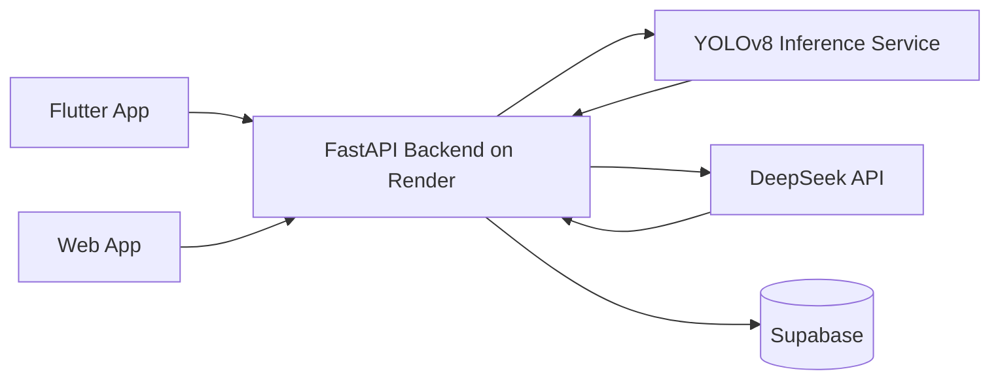

# KebunKita AI Service

## Purpose

This document explains where the trained YOLOv8 model file should go and how KebunKita uses hybrid AI for Plant Health.

KebunKita Plant Health uses:

- YOLOv8 model weights: `plant.pt`
- DeepSeek API: fallback explanation, treatment guidance, and uncertainty handling
- Memory Core: stores diagnosis history and recommendations

## Important Clarification

`plant.pt` is not the training dataset. It is the trained YOLOv8 model weights.

The raw training dataset should stay outside the backend deployment. Keep raw images, labels, and training notebooks in a separate dataset folder, cloud storage, or training workspace.

## Recommended Architecture

For production and Render hosting, use this flow:



The backend should not train YOLO. The backend should call a YOLO inference service.

## Where To Put `plant.pt`

### Local Development

For local testing, put the model here:

```text
backend/ml/models/plant.pt
```

This path is intentionally ignored by Git:

```text
backend/ml/models/*.pt
```

So your model file will not be pushed to GitHub.

### Production

Recommended production options:

1. Deploy a separate YOLOv8 inference service that contains `plant.pt`.
2. Upload `plant.pt` to Supabase Storage or cloud storage and load it inside the inference service.
3. Set the backend environment variable:

```text
YOLOV8_ENDPOINT=https://your-yolo-service.com/analyze
```

Do not put large `.pt` files directly in the GitHub repo unless the file is very small and you intentionally want it versioned.

## Why Separate AI Service Is Better

Render backend should stay light:

- Handles API routes.
- Handles Supabase.
- Handles DeepSeek.
- Handles access limits.
- Calls YOLO service.

YOLO service handles:

- Loading `plant.pt`.
- Running image inference.
- Returning status, label, and confidence.

This keeps the main backend faster to deploy and easier to debug.

## Expected YOLO Endpoint Contract

The current backend sends this JSON to `YOLOV8_ENDPOINT`:

```json
{
  "image_name": "leaf_spot.jpg",
  "image_base64": "..."
}
```

The YOLO service should return:

```json
{
  "status": "diseased",
  "confidence": 0.87,
  "label": "Leaf Spot",
  "reason": "Detected disease pattern on leaf"
}
```

Allowed `status` values:

- `healthy`
- `diseased`
- `unknown`

## Hybrid Plant Health Flow

1. User uploads or captures plant image.
2. Backend sends image to YOLOv8 inference service.
3. YOLOv8 returns plant health result and confidence.
4. If confidence is high:
   - Backend returns diagnosis and treatment plan.
   - Result is saved to Supabase and Memory Core.
5. If confidence is low or result is unknown:
   - Backend sends YOLO result, image name, notes, and memory context to DeepSeek.
   - DeepSeek returns explanation, treatment guidance, or uncertainty.
   - Result is saved to Supabase and Memory Core.

## Training Dataset Location

Raw dataset should not live inside the backend deployment.

Recommended training structure outside production backend:

```text
training/
  datasets/
    plant-health/
      images/
        train/
        val/
      labels/
        train/
        val/
      data.yaml
  runs/
  notebooks/
```

After training, export/copy only the final model:

```text
plant.pt
```

Then use it in the YOLO inference service.

## Environment Variables

Backend:

```text
YOLOV8_ENDPOINT=https://your-yolo-service.com/analyze
DEEPSEEK_API_KEY=...
DEEPSEEK_BASE_URL=https://api.deepseek.com/v1/chat/completions
DEEPSEEK_MODEL=deepseek-chat
```

YOLO service:

```text
YOLO_MODEL_PATH=backend/ml/models/plant.pt
```

or:

```text
YOLO_MODEL_URL=https://your-storage-url/plant.pt
```

## MVP Recommendation

For the fastest MVP:

1. Keep main backend on Render.
2. Deploy YOLOv8 inference separately.
3. Put `plant.pt` inside the YOLO inference service or load it from storage.
4. Set `YOLOV8_ENDPOINT` in Render backend.
5. Keep DeepSeek API in the main backend for fallback.

