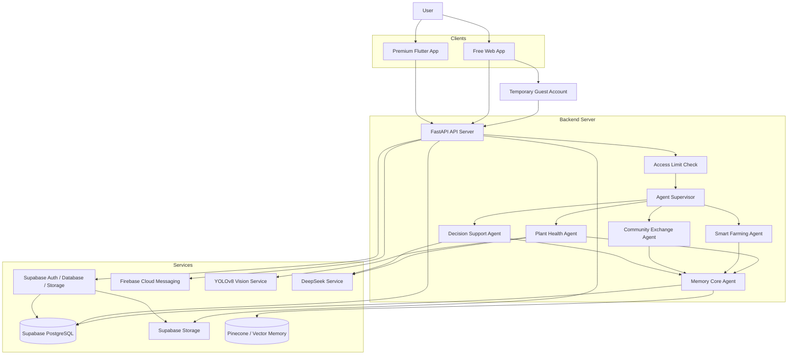
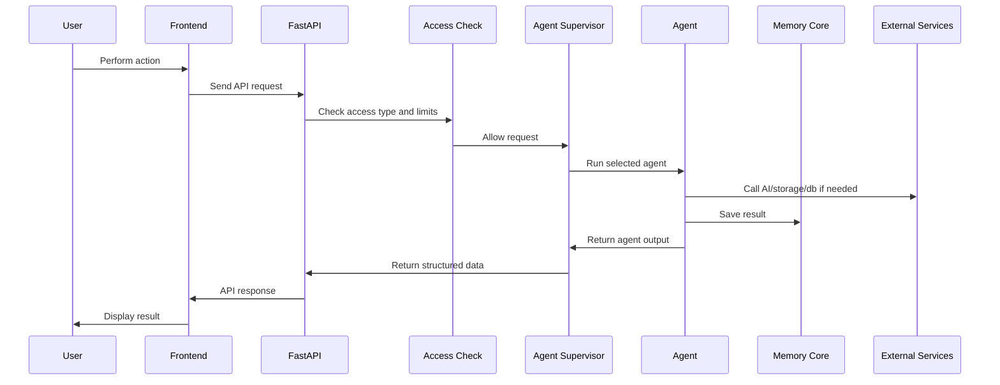

# KebunKita Architecture

## Purpose

This document explains the technical architecture for KebunKita. It describes how the frontend, Flutter app, Supabase backend, agents, AI services, database, storage, Firebase Cloud Messaging, memory, and temporary access rules work together.

## Architecture Overview

KebunKita uses a client-server architecture with agent-based backend workflows.

## Main Layers

| Layer | Responsibility |
| --- | --- |
| Clients | Web App and Flutter App user interfaces |
| API Server | Receives requests, validates data, checks access, returns responses |
| Agent Layer | Runs KebunKita product workflows |
| AI Layer | Performs plant vision analysis and LLM fallback support |
| Memory Layer | Stores user and agent history |
| Data Layer | Stores users, plants, posts, trades, tasks, and audit records |
| Storage Layer | Stores uploaded plant images and media |
| Push Layer | Delivers Flutter push notifications through Firebase Cloud Messaging |

## Clients

### Free Web App

The Web App is opened through a browser and is used for quick testing during the hackathon day.

Responsibilities:

- Create or reuse a temporary guest account.
- Let users test limited KebunKita functions.
- Show guest mode and usage limits when needed.
- Send requests to the backend API.

### Premium Flutter App

The Flutter App represents the full mobile experience.

Responsibilities:

- Provide full access to all product flows.
- Support camera capture, optional video, plant journey album, push notifications, saved garden state, and unlimited chat/trade usage.
- Authenticate through Supabase.
- Register the Firebase Cloud Messaging device token after login.
- Send requests to the same backend API or Supabase-backed API layer.

## Backend Server

The MVP backend stack uses Supabase for auth, database, and storage. A FastAPI, Laravel, or Supabase Edge Function layer can be used for server-side workflows that need protected service keys, AI calls, or push notification dispatch.

Main responsibilities:

- Expose REST endpoints.
- Validate request data.
- Enforce temporary access limits.
- Route workflows through the Agent Supervisor.
- Call AI, storage, database, and memory services.
- Send push notification requests to Firebase Cloud Messaging when needed.
- Return structured responses to the frontend.

Main files:

- `backend/main.py`
- `backend/api/agents_api.py`
- `backend/models/schemas.py`
- `backend/agents/`
- `backend/lib/ai_hooks.py`
- `backend/tools/memory_tools.py`

## Agent Layer

The agent layer turns user actions into product workflows.

| Agent | Responsibility |
| --- | --- |
| Agent Supervisor | Routes API requests to the correct agent |
| Plant Health Agent | Diagnoses plant health from image input |
| Smart Farming Agent | Generates plant care tasks and reasons |
| Community Exchange Agent | Matches harvest posts and barter opportunities |
| Decision Support Agent | Answers farming questions and recommends actions |
| Memory Core Agent | Saves and retrieves user context and agent results |

See [AGENTS.md](AGENTS.md) for full agent details.

## AI Layer

KebunKita uses AI in two main ways.

### Vision AI

YOLOv8 is used for first-pass plant image analysis.

Used by:

- Plant Health.
- AI Disease Detection.
- Camera Function.

Expected output:

- Plant health status.
- Disease label when available.
- Confidence score.

### LLM Fallback

DeepSeek is used when the system needs deeper explanation or fallback reasoning.

Used by:

- Plant Health low-confidence fallback.
- Decision Support answers.
- Crop and treatment recommendation explanations.

Guardrail:

- If evidence is weak, return uncertainty instead of inventing a diagnosis.

## Memory Architecture

Memory Core stores useful user and agent history.

Examples:

- Plant diagnosis history.
- Treatment plans.
- Smart farming tasks.
- Watering and care logs.
- Community exchange activity.
- Decision support questions and answers.
- User budget, space, goal, and timeline context.

Storage options:

- In-memory store for development.
- PostgreSQL/Supabase for production records.
- Pinecone/vector store for semantic memory.

## Data Architecture

Suggested production data groups:

| Data Group | Examples |
| --- | --- |
| Users | account, access type, profile, guest flag |
| Guest Usage | feature usage count, activity limit, session expiration |
| Plants | name, type, planted date, photo, garden location |
| Care Tasks | task time, task name, reason, status |
| Care History | watered, fertilized, inspected, disease check |
| Plant Diagnosis | image reference, status, confidence, treatment |
| Community Posts | harvest, question, advice, media, comments |
| Marketplace Listings | crop, quantity, price, barter status, location |
| Trades | offer, requested item, status, chat reference |
| Memory | agent name, payload, timestamp |

## Storage Architecture

Storage is used for media and generated files.

Stored files may include:

- Plant upload images.
- Camera diagnosis images.
- Community feed images.
- Marketplace listing images.
- Plant journey album images.

Development can use local file storage. Production should use Supabase Storage, S3-compatible storage, or another managed object storage service.

## Push Notification Architecture

Firebase is used only for push notification delivery. KebunKita does not need to move the whole project to Firebase.

MVP split:

- Supabase: Auth, PostgreSQL database, Storage.
- Firebase Cloud Messaging: push notifications only.

Example notification flow:

1. User logs in through the Flutter App.
2. Flutter App gets the Firebase Cloud Messaging device token.
3. App saves the FCM token into a Supabase table.
4. When a notification is needed, a Supabase Edge Function or Laravel/backend service sends a request to FCM.
5. FCM delivers the push notification to the user's device.
6. User receives reminders such as watering tasks, trade updates, or community activity.

## Access Control Architecture

For the hackathon-day setup, access is temporary and split into two tiers.

| Access Type | Description |
| --- | --- |
| Free Web App Guest | Browser-based guest account with limited usage |
| Premium Flutter | Full-access mobile app experience |

The backend should enforce usage limits. The frontend may display limits, but it should not be the only enforcement layer.

| Function | Activity | Free Web App Guest | Premium Flutter |
| --- | --- | --- | --- |
| Plant Health | User upload picture | 1 | Unlimited |
| Plant Health | Analyze images | Yes | Yes |
| Plant Health | User take picture | 1 | Unlimited |
| Plant Health | User take video optional | Not available | Yes |
| Plant Health | Save album journey picture | Not available | Yes |
| Plant Health | Save to smart farming | Not available | Yes |
| Smart Farming | Accept plant name new plant | Not available | Yes |
| Smart Farming | Generate task time, task name, reason | Yes | Yes |
| Smart Farming | Push notification | Not available | Yes |
| Community Exchange | User post | Yes | Yes |
| Community Exchange | Trade | 1 | Unlimited |
| Decision Support | Chat message | 5 | Unlimited |

## Live Request Flow

## Feature Flow Mapping

| Product Area | Frontend Screen | Backend Route | Agent |
| --- | --- | --- | --- |
| Plant Health | AI Tools, Camera Function, Plant Health | `POST /api/agents/plant-health` | Plant Health Agent |
| Smart Farming | My Garden, Add Plant, Crop Details | `POST /api/agents/smart-farming` | Smart Farming Agent |
| Community Exchange | Feed, Marketplace, Barter | `POST /api/agents/community-exchange` | Community Exchange Agent |
| Decision Support | Chat, Farming Advisor | `POST /api/agents/decision-support` | Decision Support Agent |
| Memory History | Profile, Debug, Context Reuse | `GET /api/agents/memory/{user_id}` | Memory Core Agent |

## Deployment Shape

Recommended deployment:

- Frontend Web App: static hosting.
- Flutter App: mobile build connected to Supabase and Firebase Cloud Messaging.
- Backend: Supabase Auth, Supabase PostgreSQL, Supabase Storage, plus Supabase Edge Functions, Laravel, or FastAPI for protected workflows.
- Database: Supabase PostgreSQL.
- Storage: Supabase Storage.
- Push Notification: Firebase Cloud Messaging only.
- AI Vision: managed YOLOv8 endpoint or self-hosted inference server.
- LLM: DeepSeek API.
- Memory: PostgreSQL for records, Pinecone for vector memory if needed.

## Environment Variables

Important backend environment variables:

- `YOLOV8_ENDPOINT`
- `DEEPSEEK_API_KEY`
- `DEEPSEEK_BASE_URL`
- `DEEPSEEK_MODEL`
- `SUPABASE_URL`
- `SUPABASE_KEY`
- `SUPABASE_SERVICE_ROLE_KEY`
- `FIREBASE_PROJECT_ID`
- `FIREBASE_CLIENT_EMAIL`
- `FIREBASE_PRIVATE_KEY`
- `PINECONE_API_KEY`
- `PINECONE_ENV`
- `PINECONE_INDEX_NAME`

## Reliability and Safety

Architecture requirements:

- API responses must use structured schemas.
- Access limits must be enforced server-side.
- AI fallback must not block the whole user flow.
- Low-confidence diagnosis must return uncertainty.
- Memory saving should be resilient to temporary storage failures.
- FCM token storage should be tied to the authenticated Supabase user.
- Uploaded images should not expose private user data.
- Guest data should be removable after the event.

## Future Architecture Enhancements

- Notification service for push reminders.
- Dedicated marketplace/trade service.
- Moderation service for community content.
- Auth service for production accounts.
- Analytics service for product metrics.
- Background worker for scheduled care tasks.
- CDN for image delivery.
- Admin dashboard for communities, users, and content.
