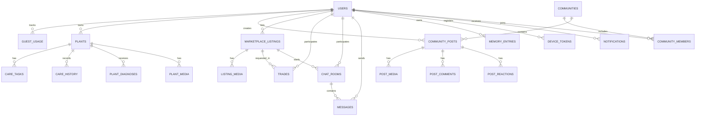

# KebunKita Database Structure

## Purpose

This document describes the proposed database structure for KebunKita. The schema is designed for Supabase PostgreSQL and supports the Web App, Flutter App, agents, temporary guest access, plant care, community exchange, marketplace, barter, chat, push notification tokens, and Memory Core.

## Database Goals

- Store permanent users and temporary guest users.
- Enforce hackathon-day access limits.
- Track plants, care tasks, care history, and diagnosis history.
- Support community posts, comments, and media.
- Support marketplace listings, barter offers, trades, chat rooms, and realtime messages.
- Store Firebase Cloud Messaging device tokens for push notifications.
- Store Memory Core entries from agents.
- Keep the schema simple enough for MVP but expandable for production.

## Entity Relationship Overview

## Naming Conventions

- Table names use lowercase snake case.
- Primary keys use `id`.
- Foreign keys use `{table_singular}_id`, for example `user_id`.
- Timestamps use `created_at` and `updated_at`.
- Flexible AI/agent payloads use `jsonb`.
- Status fields use text enums or constrained strings.

## Core Tables

### users

Stores permanent users and temporary guest users.

| Column | Type | Notes |
| --- | --- | --- |
| id | uuid primary key | User id |
| email | text nullable unique | Null allowed for temporary guests |
| full_name | text nullable | Display name |
| avatar_url | text nullable | Profile image |
| access_type | text | `guest`, `free`, `premium`, `admin` |
| provider | text nullable | `email`, `google`, `facebook`, `guest` |
| is_guest | boolean | True for temporary browser accounts |
| guest_expires_at | timestamptz nullable | Expiration for temporary event accounts |
| location_text | text nullable | User area, for example Tanjung Malim |
| created_at | timestamptz | Creation time |
| updated_at | timestamptz | Last update time |

Recommended indexes:

- `users_email_idx`
- `users_access_type_idx`
- `users_is_guest_idx`

### guest_usage

Tracks temporary usage limits for the Free Web App guest flow.

| Column | Type | Notes |
| --- | --- | --- |
| id | uuid primary key | Usage id |
| user_id | uuid foreign key users.id | Guest user |
| function_name | text | Example: `plant_health` |
| activity_name | text | Example: `upload_picture` |
| usage_count | integer | Current usage |
| usage_limit | integer nullable | Null means unlimited |
| reset_at | timestamptz nullable | Optional reset time |
| created_at | timestamptz | Creation time |
| updated_at | timestamptz | Last update time |

Recommended constraints:

- Unique key on `user_id`, `function_name`, `activity_name`.

### device_tokens

Stores Firebase Cloud Messaging tokens for Flutter push notifications.

| Column | Type | Notes |
| --- | --- | --- |
| id | uuid primary key | Token record id |
| user_id | uuid foreign key users.id | Supabase user |
| fcm_token | text unique | Firebase Cloud Messaging device token |
| platform | text | `android`, `ios`, `web` |
| device_name | text nullable | Optional device label |
| is_active | boolean default true | Whether token can receive pushes |
| last_seen_at | timestamptz nullable | Last app activity |
| created_at | timestamptz | Creation time |
| updated_at | timestamptz | Last update time |

Recommended indexes:

- `device_tokens_user_id_idx`
- `device_tokens_is_active_idx`

## Garden Tables

### plants

Stores user plants in My Garden.

| Column | Type | Notes |
| --- | --- | --- |
| id | uuid primary key | Plant id |
| user_id | uuid foreign key users.id | Owner |
| community_id | uuid foreign key communities.id nullable | Optional linked community |
| name | text | Example: Cherry Tomato |
| category | text | `vegetable`, `fruit`, `herb`, `leafy_green`, `flower`, `other` |
| image_url | text nullable | Main plant image |
| planted_date | date nullable | Date planted |
| location | text nullable | Example: South Sector, Row 4 |
| sunlight | text nullable | `full_sun`, `partial_shade`, `shade` |
| watering_frequency | text nullable | `daily`, `every_2_days`, `weekly` |
| growth_percentage | integer default 0 | 0 to 100 |
| estimated_harvest_date | date nullable | Expected harvest date |
| status | text | `active`, `harvested`, `archived` |
| created_at | timestamptz | Creation time |
| updated_at | timestamptz | Last update time |

Recommended indexes:

- `plants_user_id_idx`
- `plants_community_id_idx`
- `plants_status_idx`

### plant_media

Stores plant journey album images and videos.

| Column | Type | Notes |
| --- | --- | --- |
| id | uuid primary key | Media id |
| plant_id | uuid foreign key plants.id | Related plant |
| user_id | uuid foreign key users.id | Owner |
| media_url | text | Storage URL |
| media_type | text | `image`, `video` |
| caption | text nullable | Optional caption |
| created_at | timestamptz | Creation time |

### care_logs

Stores completed plant-care actions.

| Column | Type | Notes |
| --- | --- | --- |
| id | uuid primary key | Log id |
| plant_id | uuid foreign key plants.id | Related plant |
| action_type | text | `watered`, `fertilized`, `note`, `inspected`, `diagnosed` |
| note | text nullable | Optional note |
| created_at | timestamptz | Creation time |

Recommended indexes:

- `care_logs_plant_id_idx`
- `care_logs_action_type_idx`
- `care_logs_created_at_idx`

### care_reminders

Stores scheduled plant-care reminders.

| Column | Type | Notes |
| --- | --- | --- |
| id | uuid primary key | Reminder id |
| plant_id | uuid foreign key plants.id | Related plant |
| reminder_type | text | `water`, `fertilizer`, `inspection`, `harvest`, `custom` |
| due_time | timestamptz | Reminder due time |
| status | text | `pending`, `sent`, `done`, `skipped`, `expired` |
| created_at | timestamptz | Creation time |

### plant_diagnoses

Stores AI disease detection results.

| Column | Type | Notes |
| --- | --- | --- |
| id | uuid primary key | Diagnosis id |
| user_id | uuid foreign key users.id | Owner |
| plant_id | uuid foreign key plants.id nullable | Related plant if saved |
| image_url | text nullable | Uploaded/captured image |
| status | text | `healthy`, `diseased`, `unknown` |
| disease_name | text nullable | Disease label |
| confidence | numeric | 0 to 1 |
| symptoms | jsonb | List of symptoms |
| treatment_plan | jsonb | List of treatment steps |
| recommendation | text | User-facing recommendation |
| ai_payload | jsonb nullable | Raw or summarized AI output |
| created_at | timestamptz | Creation time |

Recommended indexes:

- `plant_diagnoses_user_id_idx`
- `plant_diagnoses_plant_id_idx`
- `plant_diagnoses_status_idx`

## Community Tables

### communities

Stores local growing communities.

| Column | Type | Notes |
| --- | --- | --- |
| id | uuid primary key | Community id |
| name | text | Community name |
| description | text nullable | Short description |
| area | text nullable | Neighborhood or area |
| visibility | text | `public`, `private` |
| image_url | text nullable | Community banner |
| created_by | uuid foreign key users.id | Creator |
| created_at | timestamptz | Creation time |
| updated_at | timestamptz | Last update time |

### community_members

Stores community memberships.

| Column | Type | Notes |
| --- | --- | --- |
| id | uuid primary key | Membership id |
| community_id | uuid foreign key communities.id | Community |
| user_id | uuid foreign key users.id | Member |
| role | text | `owner`, `moderator`, `member` |
| status | text | `active`, `pending`, `blocked` |
| joined_at | timestamptz | Join time |

Recommended constraints:

- Unique key on `community_id`, `user_id`.

### community_posts

Stores feed posts.

| Column | Type | Notes |
| --- | --- | --- |
| id | uuid primary key | Post id |
| user_id | uuid foreign key users.id | Author |
| community_id | uuid foreign key communities.id nullable | Community |
| post_type | text | `harvest`, `question`, `advice`, `progress`, `tip` |
| body | text | Post content |
| plant_id | uuid foreign key plants.id nullable | Tagged plant |
| location_text | text nullable | Example: Tanjung Malim |
| created_at | timestamptz | Creation time |
| updated_at | timestamptz | Last update time |

### post_media

Stores feed media.

| Column | Type | Notes |
| --- | --- | --- |
| id | uuid primary key | Media id |
| post_id | uuid foreign key community_posts.id | Related post |
| media_url | text | Storage URL |
| media_type | text | `image`, `video` |
| sort_order | integer | Display order |
| created_at | timestamptz | Creation time |

### post_comments

Stores comments and suggested solutions.

| Column | Type | Notes |
| --- | --- | --- |
| id | uuid primary key | Comment id |
| post_id | uuid foreign key community_posts.id | Related post |
| user_id | uuid foreign key users.id | Author |
| body | text | Comment text |
| comment_type | text | `comment`, `solution` |
| created_at | timestamptz | Creation time |

### post_reactions

Stores likes or reactions.

| Column | Type | Notes |
| --- | --- | --- |
| id | uuid primary key | Reaction id |
| post_id | uuid foreign key community_posts.id | Related post |
| user_id | uuid foreign key users.id | User |
| reaction_type | text | `like`, `save` |
| created_at | timestamptz | Creation time |

Recommended constraints:

- Unique key on `post_id`, `user_id`, `reaction_type`.

## Marketplace and Barter Tables

### marketplace_listings

Stores produce listings.

| Column | Type | Notes |
| --- | --- | --- |
| id | uuid primary key | Listing id |
| user_id | uuid foreign key users.id | Seller/owner |
| title | text | Example: Fresh Red Chilies |
| crop_name | text | Crop name |
| description | text nullable | Listing description |
| quantity | text nullable | Example: 3kg |
| price_amount | numeric nullable | Example: 4.50 |
| price_unit | text nullable | Example: per 500g |
| listing_type | text | `sell`, `barter`, `both` |
| location_text | text nullable | Listing location |
| is_organic | boolean default false | Organic certified badge |
| is_pesticide_free | boolean default false | Pesticide free tag |
| harvested_at | date nullable | Harvest date |
| status | text | `active`, `reserved`, `traded`, `closed` |
| created_at | timestamptz | Creation time |
| updated_at | timestamptz | Last update time |

Recommended indexes:

- `marketplace_listings_status_idx`
- `marketplace_listings_user_id_idx`
- `marketplace_listings_crop_name_idx`

### listing_media

Stores marketplace listing images.

| Column | Type | Notes |
| --- | --- | --- |
| id | uuid primary key | Media id |
| listing_id | uuid foreign key marketplace_listings.id | Related listing |
| media_url | text | Storage URL |
| media_type | text | `image`, `video` |
| sort_order | integer | Display order |
| created_at | timestamptz | Creation time |

### trades

Stores barter/trade records.

| Column | Type | Notes |
| --- | --- | --- |
| id | uuid primary key | Trade id |
| listing_id | uuid foreign key marketplace_listings.id nullable | Requested listing |
| requester_id | uuid foreign key users.id | User requesting trade |
| owner_id | uuid foreign key users.id | Listing owner |
| offered_plant_id | uuid foreign key plants.id nullable | Offered garden item |
| offered_title | text | Example: 2kg Kangkong |
| requested_title | text | Example: 500g Bird's Eye Chilies |
| message | text nullable | Optional message |
| status | text | `proposed`, `accepted`, `rejected`, `completed`, `cancelled` |
| completed_at | timestamptz nullable | Completion time |
| created_at | timestamptz | Creation time |
| updated_at | timestamptz | Last update time |

Recommended indexes:

- `trades_requester_id_idx`
- `trades_owner_id_idx`
- `trades_status_idx`

### chat_rooms

Stores direct marketplace conversations between an interested buyer and the listing owner.

| Column | Type | Notes |
| --- | --- | --- |
| id | uuid primary key | Chat room id |
| marketplace_item_id | uuid foreign key marketplace_listings.id | Listing being discussed |
| buyer_id | uuid foreign key users.id | Interested user |
| seller_id | uuid foreign key users.id | Listing owner |
| created_at | timestamptz | Creation time |
| updated_at | timestamptz | Last activity time |

Recommended constraints:

- Unique key on `marketplace_item_id`, `buyer_id`, `seller_id`.

### messages

Stores direct marketplace chat messages for a chat room.

| Column | Type | Notes |
| --- | --- | --- |
| id | uuid primary key | Message id |
| chat_room_id | uuid foreign key chat_rooms.id | Related room |
| sender_id | uuid foreign key users.id | Sender |
| message | text | Message body |
| is_read | boolean | Simple unread state |
| created_at | timestamptz | Creation time |

Recommended indexes:

- `messages_chat_room_id_created_at_idx` on `chat_room_id`, `created_at`

### chat_messages

Legacy trade chat table from the older barter flow. Keep only if you still need the previous trade-specific conversation design.

| Column | Type | Notes |
| --- | --- | --- |
| id | uuid primary key | Message id |
| trade_id | uuid foreign key trades.id nullable | Trade conversation |
| sender_id | uuid foreign key users.id | Sender |
| receiver_id | uuid foreign key users.id nullable | Receiver |
| body | text nullable | Message text |
| message_type | text | `text`, `image`, `barter_offer`, `system` |
| media_url | text nullable | Optional image |
| payload | jsonb nullable | Proposal card or system data |
| created_at | timestamptz | Creation time |

Recommended indexes:

- `chat_messages_trade_id_created_idx` on `trade_id`, `created_at`

## Agent and Memory Tables

### memory_entries

Stores agent memory records.

| Column | Type | Notes |
| --- | --- | --- |
| id | uuid primary key | Memory id |
| user_id | uuid foreign key users.id | Related user |
| agent_name | text | `plant_health`, `smart_farming`, `community_exchange`, `decision_support` |
| payload | jsonb | Agent memory payload |
| summary | text nullable | Human-readable summary |
| vector_id | text nullable | Pinecone/vector reference |
| created_at | timestamptz | Creation time |

Recommended indexes:

- `memory_entries_user_id_idx`
- `memory_entries_agent_name_idx`
- GIN index on `payload` if querying jsonb fields.

### agent_runs

Optional table for debugging and audit trail.

| Column | Type | Notes |
| --- | --- | --- |
| id | uuid primary key | Run id |
| user_id | uuid foreign key users.id nullable | Related user |
| agent_name | text | Agent name |
| input_payload | jsonb | Request input |
| output_payload | jsonb nullable | Agent output |
| status | text | `success`, `failed`, `fallback` |
| error_message | text nullable | Failure reason |
| started_at | timestamptz | Start time |
| completed_at | timestamptz nullable | Completion time |

## Notification Tables

### notifications

Stores reminders and app notifications.

| Column | Type | Notes |
| --- | --- | --- |
| id | uuid primary key | Notification id |
| user_id | uuid foreign key users.id | Recipient |
| device_token_id | uuid foreign key device_tokens.id nullable | Target device token |
| notification_type | text | `care_reminder`, `trade_update`, `community`, `system` |
| title | text | Notification title |
| body | text | Notification body |
| related_table | text nullable | Example: `care_reminders` |
| related_id | uuid nullable | Related record id |
| fcm_message_id | text nullable | Response id from Firebase Cloud Messaging |
| error_message | text nullable | Send failure reason |
| status | text | `pending`, `sent`, `read`, `failed` |
| scheduled_at | timestamptz nullable | Schedule time |
| sent_at | timestamptz nullable | Sent time |
| created_at | timestamptz | Creation time |

## Suggested MVP Table Priority

Build these first:

1. `users`
2. `guest_usage`
3. `plants`
4. `care_logs`
5. `care_reminders`
6. `plant_diagnoses`
7. `community_posts`
8. `marketplace_listings`
9. `trades`
10. `chat_rooms`
11. `messages`
12. `memory_entries`
13. `device_tokens`
14. `notifications`

Add later:

- `communities`
- `community_members`
- `post_media`
- `post_comments`
- `post_reactions`
- `listing_media`
- `agent_runs`
- `plant_media`

## Supabase Notes

If using Supabase:

- Use Supabase Auth for permanent users.
- Keep temporary guest users in `users` with `is_guest = true`.
- Use Row Level Security for user-owned rows.
- Store images in Supabase Storage buckets.
- Store Firebase Cloud Messaging tokens in `device_tokens`.
- Use Supabase Edge Functions or a Laravel/backend service to send server-side requests to FCM.
- Use policies so users can only access their own plants, care logs, diagnoses, chat rooms, messages, and memory.
- Enable Supabase Realtime on `messages` so marketplace chats update instantly during the demo.
- Public community posts and marketplace listings can have broader read access.

Suggested storage buckets:

- `plant-images`
- `community-media`
- `marketplace-media`
- `avatars`

## Supabase SQL Schema

Use [SUPABASE_SCHEMA.sql](SUPABASE_SCHEMA.sql) to create the MVP database in Supabase.

How to use:

1. Open Supabase Dashboard.
2. Go to SQL Editor.
3. Paste the full SQL from `SUPABASE_SCHEMA.sql`.
4. Run the script.
5. Confirm tables, indexes, storage buckets, and RLS policies are created.

If your Supabase database was already created with the older smart-farming schema, run `SUPABASE_MY_GARDEN_UPDATE.sql` instead of recreating the database. That migration adds the new My Garden fields and creates `care_logs` and `care_reminders`.

The schema also creates an auth trigger so new Supabase Auth users are copied into `public.users` with the same `id`. This is important because the RLS policies compare `auth.uid()` with table `user_id` values.

## Access Limit Enforcement

The `guest_usage` table should enforce the temporary hackathon-day limits.

Example logic:

1. Backend receives request.
2. Backend checks `users.access_type`.
3. If user is `guest`, backend checks `guest_usage`.
4. If usage limit is available, increment `usage_count`.
5. If limit is reached, return a friendly access-limit response.
6. Premium Flutter users bypass guest limits.

## Push Notification Flow

Firebase Cloud Messaging is used only for push notification delivery. Supabase remains the backend for auth, database, and storage.

Flow:

1. User logs in through Flutter using Supabase Auth.
2. Flutter app requests notification permission.
3. Flutter app receives an FCM device token.
4. Flutter app saves the token into `device_tokens`.
5. When a reminder or trade update is needed, the backend creates a `notifications` row.
6. Supabase Edge Function or Laravel/backend service sends the notification to FCM.
7. FCM returns a message id or error.
8. Backend updates `notifications.status`, `fcm_message_id`, and `error_message` when needed.

## Data Privacy Notes

- Do not store unnecessary personal data for temporary guests.
- Guest data should expire after the event.
- Uploaded plant images should be treated as user data.
- Location should be stored as text for MVP unless precise coordinates are required.
- Chat rooms, messages, and trade records should only be visible to involved users.
