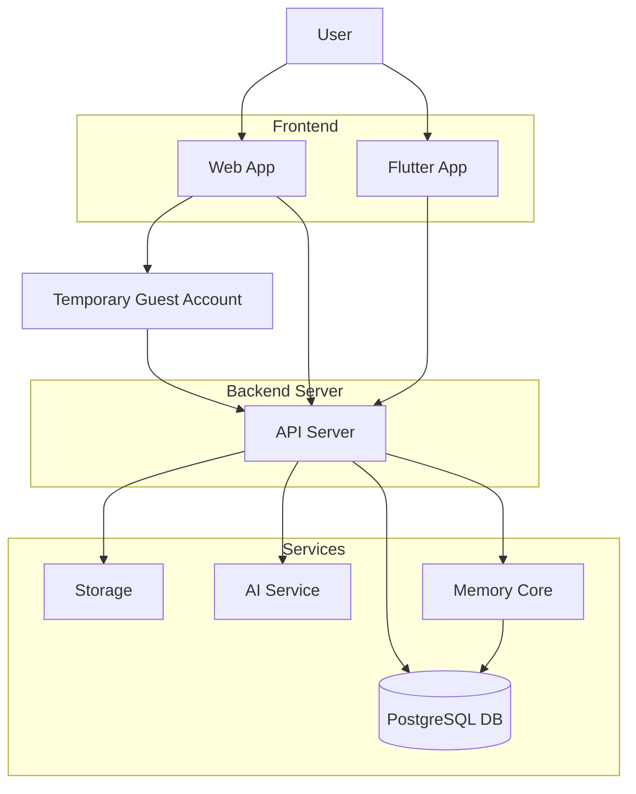

# KebunKita System Architecture Document

## Overview

KebunKita uses a client-server architecture with AI-assisted services and persistent memory. The user interacts through a frontend client, the backend handles live API functions, and the services layer stores data, files, memory, and AI results.

## Architecture Layers

### User

The user manages plants, uploads images, receives farming tasks, posts harvests, and asks for recommendations.

### Frontend

The frontend contains the Web App and planned Flutter App. It handles screens, forms, image upload, chat input, live status, and result display. For the hackathon day, the Web App creates a temporary guest account with limited access, while Flutter represents premium full access.

### Backend Server

The backend API server receives frontend requests, validates data, runs the correct agent flow, calls services, and returns structured responses.

### Services

- PostgreSQL DB stores users, plant records, task plans, harvest posts, recommendations, and audit history.
- Storage keeps uploaded plant images and generated files.
- AI Service runs plant diagnosis and recommendation support.
- Memory Core stores previous analysis and user context for future decisions.

## Live Function Flow

1. User submits a request from the Web App or Flutter App.
2. If the user is on the free Web App, the frontend creates or reuses a temporary guest account.
3. Frontend sends the request to the Backend API Server.
4. Backend validates the request, checks access limits, and calls the correct KebunKita agent.
5. Agent uses PostgreSQL, Storage, Memory Core, and AI Service when needed.
6. Backend returns a live result to the frontend.
7. Frontend displays the result to the user.

## Main Live Functions

- Plant Health: image upload, disease analysis, confidence score, treatment plan.
- Smart Farming: daily care plan, task reminders, progress tracking.
- Community Exchange: harvest post, matching, exchange recommendations.
- Decision Support: farming questions, crop suggestions, budget and space advice.

## Temporary User Access Function

| Function | Activity | Free Web App Guest | Premium Flutter |
| --- | --- | --- | --- |
| Plant Health | User upload picture | 1 | Unlimited |
| Plant Health | Analyze images | Yes | Yes |
| Plant Health | User take picture | 1 | Unlimited |
| Plant Health | User take video optional | Not available | Yes |
| Plant Health | Save album journey picture | Not available | Yes |
| Plant Health | Save to smart farming | Not available | Yes |
| Smart Farming | Accept plant name new plant | Not available | Yes |
| Smart Farming | Generate task time, task name, reason | Yes | Yes |
| Smart Farming | Push notification | Not available | Yes |
| Community Exchange | User post | Yes | Yes |
| Community Exchange | Trade | 1 | Unlimited |
| Decision Support | Chat message | 5 | Unlimited |
