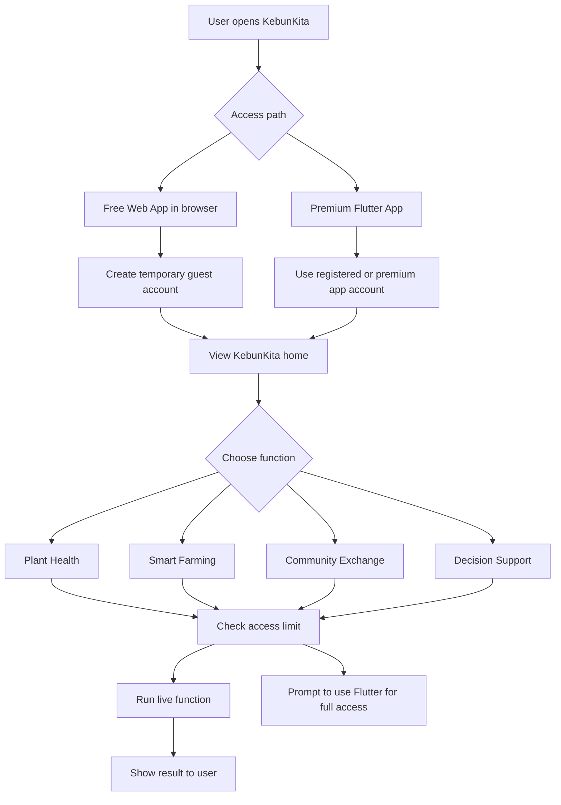
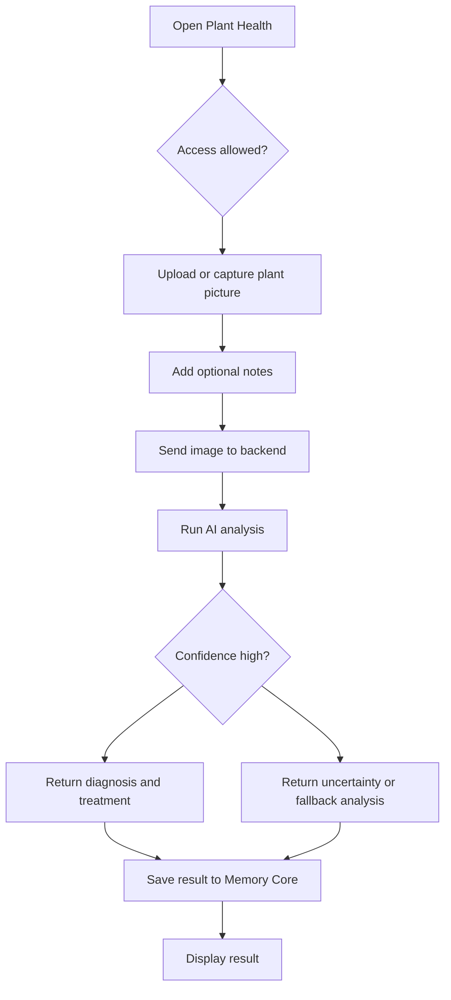
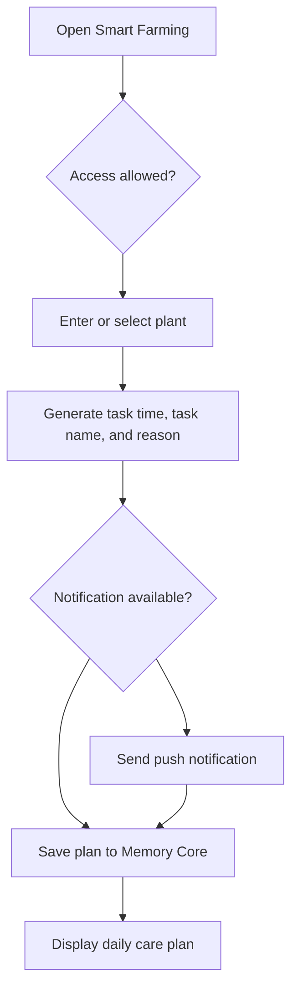
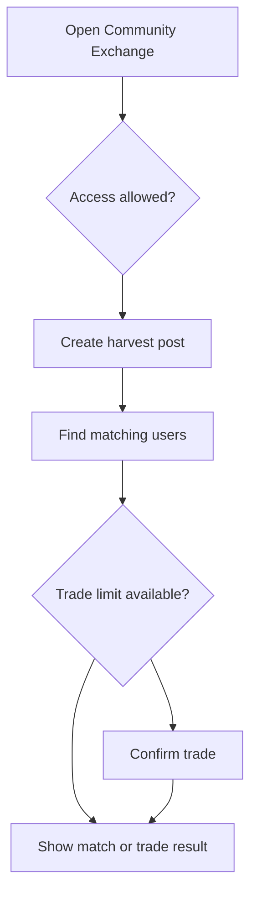
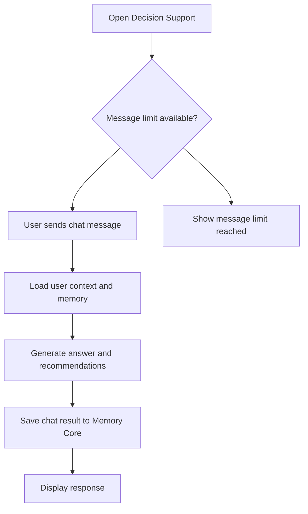

# KebunKita User Flow

## Purpose

This document describes how users move through KebunKita during the temporary hackathon-day setup and in the intended full product flow.

KebunKita has two user access paths:

- Free Web App Guest: opens KebunKita in a browser and receives a temporary guest account with limited access.
- Premium Flutter User: uses the Flutter app and receives full access to the complete KebunKita experience.

## High-Level User Flow

## Temporary Guest Account Flow

This flow is used for the free browser Web App during the hackathon day.

1. User opens the KebunKita web app in a browser.
2. System creates a temporary guest account.
3. Guest account stores only the minimum session data needed for testing.
4. User lands on the main KebunKita interface.
5. User selects one of the available functions.
6. System checks the User Access Function limit.
7. If the feature is allowed, the backend runs the live function.
8. If the feature limit is reached, the app shows that Flutter has full access.
9. Guest activity can be cleared after the event.

## Premium Flutter User Flow

This flow is used for the full-access Flutter app.

1. User opens the Flutter app.
2. User signs in or uses the assigned premium event account.
3. User lands on the main KebunKita dashboard.
4. User can access all product modules.
5. User actions are saved to Memory Core and database storage.
6. User can use unlimited Plant Health, Smart Farming, Community Exchange, and Decision Support flows according to the UAF table.
7. User receives full mobile functions such as camera capture, optional video, saved journey album, smart farming save, and push notification support.

## User Access Function Summary

| Function | Activity | Free Web App Guest | Premium Flutter |
| --- | --- | --- | --- |
| Plant Health | User upload picture | 1 | Unlimited |
| Plant Health | Analyze images | Yes | Yes |
| Plant Health | User take picture | 1 | Unlimited |
| Plant Health | User take video optional | Not available | Yes |
| Plant Health | Save album journey picture | Not available | Yes |
| Plant Health | Save to smart farming | Not available | Yes |
| Smart Farming | Accept plant name new plant | Not available | Yes |
| Smart Farming | Generate task time, task name, reason | Yes | Yes |
| Smart Farming | Push notification | Not available | Yes |
| Community Exchange | User post | Yes | Yes |
| Community Exchange | Trade | 1 | Unlimited |
| Decision Support | Chat message | 5 | Unlimited |

## Plant Health Flow

Free Web App guest limits:

- Upload picture: 1 time.
- Take picture: 1 time.
- Video, journey album, and save to smart farming are not available.

Premium Flutter access:

- Unlimited upload and capture.
- Optional video.
- Save album journey picture.
- Save plant result to Smart Farming.

## Smart Farming Flow

Free Web App guest limits:

- Can generate task time, task name, and reason.
- Cannot accept a new plant name as a saved plant profile.
- Cannot receive push notifications.

Premium Flutter access:

- Can accept new plant name.
- Can generate task plan.
- Can receive push notification reminders.

## Community Exchange Flow

Free Web App guest limits:

- Can create a user post.
- Can trade 1 time.

Premium Flutter access:

- Can create posts.
- Can trade unlimited times.

## Decision Support Flow

Free Web App guest limits:

- Chat message limit: 5 messages.

Premium Flutter access:

- Unlimited chat messages.

## Event-Day Completion Flow

1. User tests one or more features through the free Web App.
2. System stores temporary guest usage counts.
3. If the user reaches a limit, the app explains that Flutter has full access.
4. Team can reset or remove guest data after the event.
5. Product team reviews guest activity to understand which functions users tested most.

## Implementation Notes

- The frontend should create or reuse a guest session for free Web App users.
- The backend should enforce access limits because frontend-only limits can be bypassed.
- Guest accounts should be clearly marked as temporary.
- Premium Flutter access should use a separate access type so limits are easy to check.
- Usage counts should be tracked per account, per function, and per activity.

